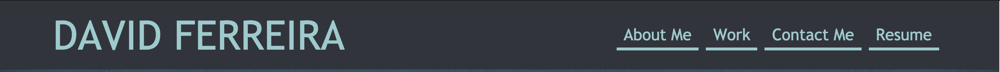
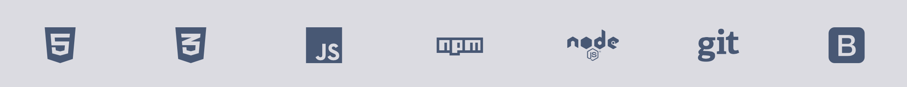
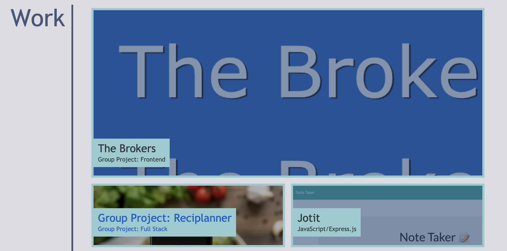

# Porfolio

## Description

My portfolio show cases some of my projects and group projects! Get a glance of my work by viewing the deployed applications and take a look at my code via github. If you like what you see, please feel free to contact me! I am always looking to connect!

  ## Table of Contents
  * [Usage](#usage)
  * [Technology](#technology)
  * [Questions](#questions)
  * [License](#license)

  
## Usage

Naviate through the different tabs on the top of the page to jump to the different sections of my website or take a look at my resume!

Directly below you'll see a list of languages and tools I utilize.

In the work section you can see my projects! Simply clicking on the tile will bring you the deployed application where you can view and test the app for yourself.

And finally, at the bottom of the page you'll see the various ways you can get in contact with me!

## Technology

* HTML5
* CSS3
* Bootstrap
* Font-awesome

## Questions
  
  Hi my name is [DiSantoz](https://github.com/DiSantoz) if you like my work and want to connect feel free to contact me at: dferreira91@outlook.com!

  You can also reach me through the other contact methods listed in the portfolio. 

## License

MIT License

Copyright (c) 2021 DiSantoz

Permission is hereby granted, free of charge, to any person obtaining a copy
of this software and associated documentation files (the "Software"), to deal
in the Software without restriction, including without limitation the rights
to use, copy, modify, merge, publish, distribute, sublicense, and/or sell
copies of the Software, and to permit persons to whom the Software is
furnished to do so, subject to the following conditions:

The above copyright notice and this permission notice shall be included in all
copies or substantial portions of the Software.

THE SOFTWARE IS PROVIDED "AS IS", WITHOUT WARRANTY OF ANY KIND, EXPRESS OR
IMPLIED, INCLUDING BUT NOT LIMITED TO THE WARRANTIES OF MERCHANTABILITY,
FITNESS FOR A PARTICULAR PURPOSE AND NONINFRINGEMENT. IN NO EVENT SHALL THE
AUTHORS OR COPYRIGHT HOLDERS BE LIABLE FOR ANY CLAIM, DAMAGES OR OTHER
LIABILITY, WHETHER IN AN ACTION OF CONTRACT, TORT OR OTHERWISE, ARISING FROM,
OUT OF OR IN CONNECTION WITH THE SOFTWARE OR THE USE OR OTHER DEALINGS IN THE
SOFTWARE.
